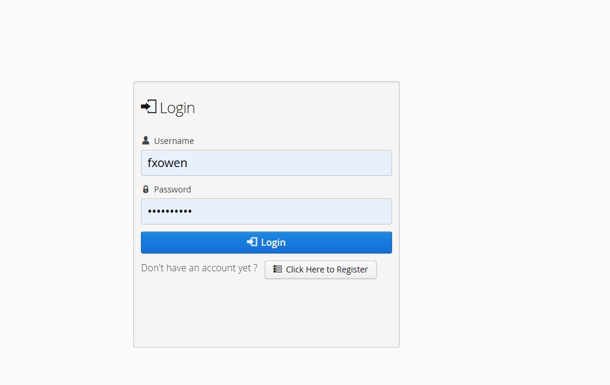
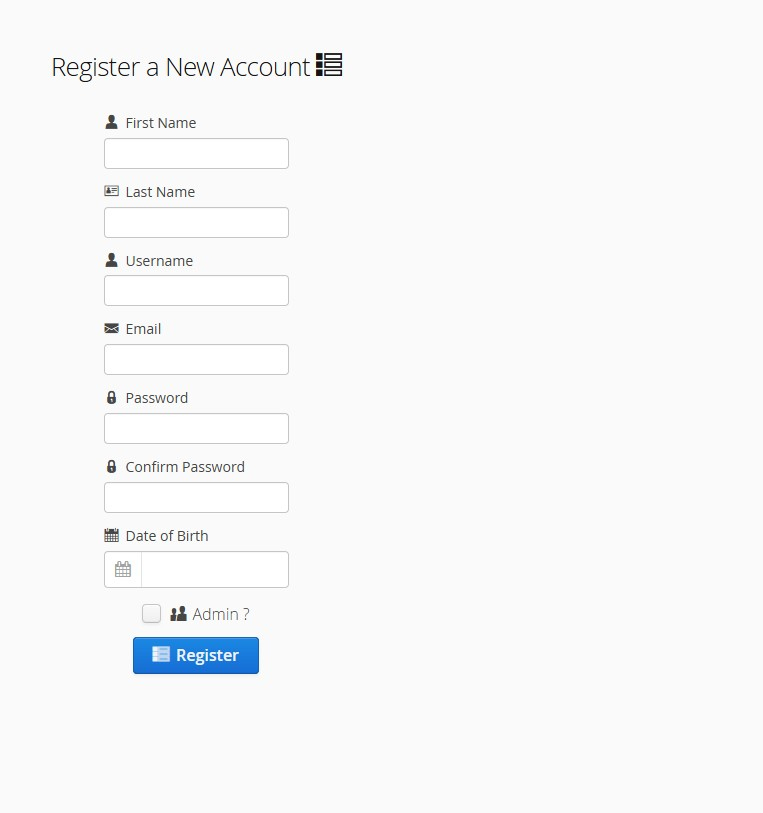
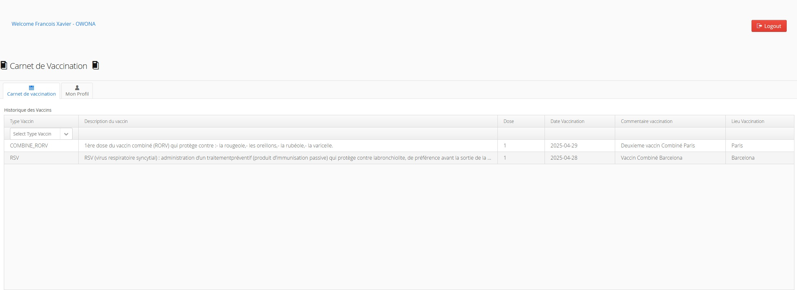
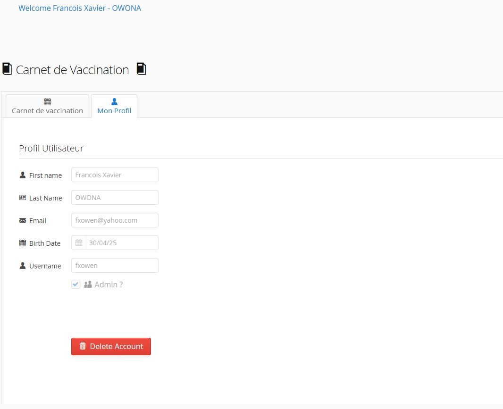

carnetvaccin-app
==============

Template for a simple Vaadin application that only requires a Servlet 3.0 container to run.

For this project i use vaadin 8.14.3, payara 4, sqlite

Workflow
========

To produce a deployable production mode WAR:
- change productionMode to true in the servlet class configuration (nested in the UI class)
- run "mvn clean package"

To deploy the application, run "PS D:\payara5\bin> .\asadmin.bat deploy --force=true "C:/Users/fxfra/OneDrive/Bureau/Projet Java Vaadin/carnetvaccin-app.war" 
and open http://localhost:8080/carnetvaccin-app/#!login.

A data source should be configured on payara
-------------------------

C:\payara5\bin\asadmin add-library sqlite-connection-pool_v1.2.0.jar
C:\payara5\bin\asadmin add-library sqlite-jdbc-3.49.1.0.jar

asadmin create-jdbc-connection-pool --datasourceclassname org.sqlite.SQLiteDataSource --restype javax.sql.DataSource --property url="jdbc\:sqlite\:C\:\Users\Public\sqlitedb\carnetvaccindb.db" SQLitePool
asadmin ping-connection-pool SQLitePool
asadmin create-jdbc-resource --connectionpoolid SQLitePool jdbc/SQLiteDataSource

the database is in the root falder of the project : carnetvaccindb.db

Few screens of the application
-------------------------

### Login Page

### Registration Page

### Main Page

### Profile Tab 

Using Vaadin pre-releases
-------------------------

If Vaadin pre-releases are not enabled by default, use the Maven parameter
"-P vaadin-prerelease" or change the activation default value of the profile in pom.xml .
